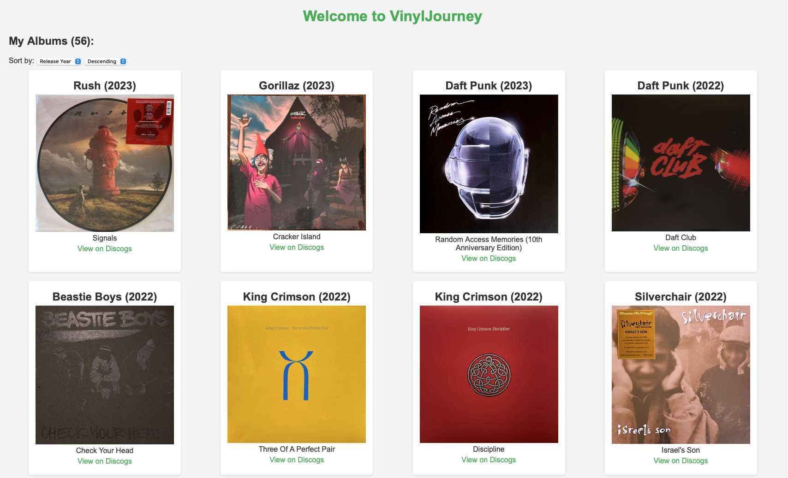
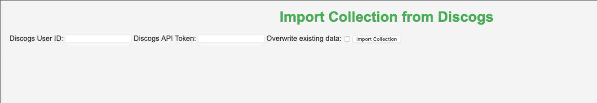
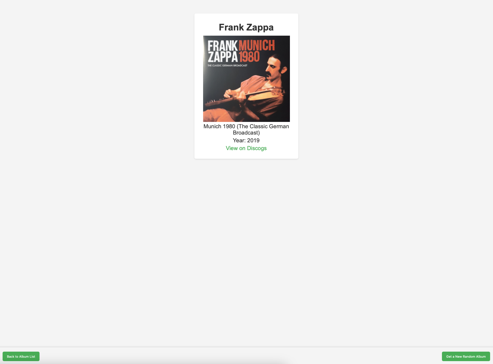

# VinylJourney

VinylJourney is a web application that allows users to manage their vinyl album collection. It integrates with the Discogs API to import collections and provides a user-friendly interface to view and sort albums.

## Features

- Import album collections from Discogs using your user ID and API token.
- View your albums with details such as artist, title, release year, cover image, and a link to the Discogs page.
- Sort albums by artist, title, or release year in ascending or descending order.
- Display a random album from your collection.

## Technologies Used

- Node.js
- Express.js
- SQLite3
- Axios
- Body-parser

## Images

### Home Page



### Import Collection



### Random Album



## Installation

1. Clone the repository:
   ```bash
   git clone <repository-url>
   cd vinyl-journey
   ```

## Usage

1. Start the server:
   ```bash
   docker-compose up --build
   ```

2. Open your browser and navigate to `http://localhost:3333`.

3. Use the application to import your Discogs collection and manage your albums.

## API Integration

To import your collection, you will need a Discogs user ID and an API token. You can obtain these by creating an account on [Discogs](https://www.discogs.com/) and generating an API token in your account settings.

## License

This project is licensed under the MIT License.
